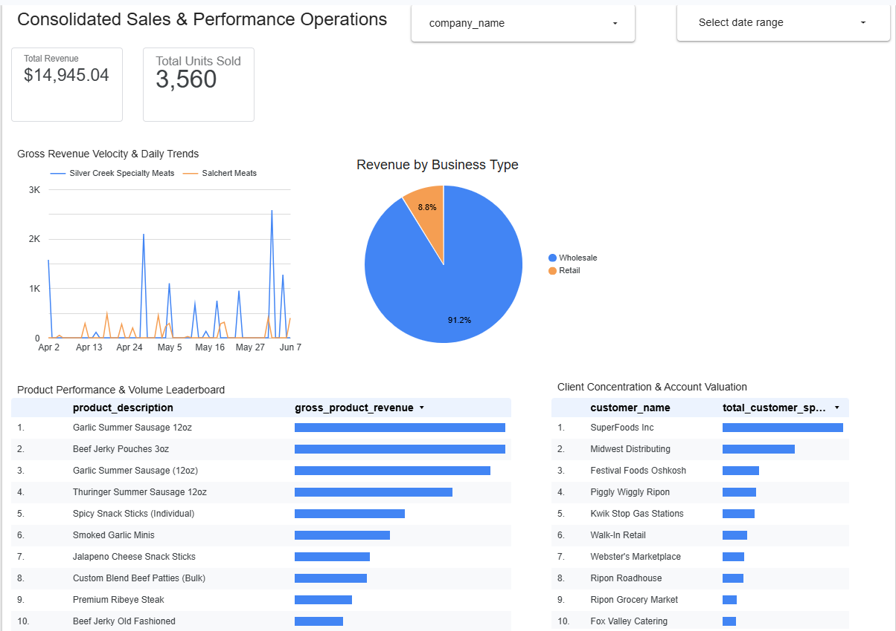

# Multi-Company Consolidated Sales Dashboard (Supabase + Looker Studio)

## 📊 Live Project Link
[👉 Click Here to Interact with the Live Dashboard](https://datastudio.google.com/s/lqB9GPfBx8s))

## 📸 Dashboard Preview


## 🏢 Project Overview
This project demonstrates a production-ready, multi-tenant analytics architecture built for a regional meat processing and wholesale portfolio (featuring data structures for **Salchert Meats** and **Silver Creek Specialty Meats**). 

Instead of fragmenting data across multiple tables or files, this solution uses a single unified database layer running on **PostgreSQL (Supabase)** and surfaces aggregated KPIs through a virtualized **SQL View** to fuel an interactive **Looker Studio** dashboard.

## 🛠️ The Tech Stack
* **Database Engine:** PostgreSQL (Supabase Cloud Hosted)
* **Analytics Layer:** Looker Studio via Direct Secure SSL PostgreSQL Connector
* **Data Design Pattern:** Single-Table Multi-Tenant Architecture with Row Level Security (RLS) Enabled

## 🗄️ Database Schema & Architecture
To test layout functionality and cross-filtering, the backend database was spun up with a unified transaction table and automated through a custom SQL view. 

### 1. The Unified Sales Table
```sql
CREATE TABLE public.meat_company_sales (
    id UUID DEFAULT gen_random_uuid() PRIMARY KEY,
    company_name TEXT NOT NULL, -- Identifies 'Salchert Meats' or 'Silver Creek'
    invoice_number TEXT,
    customer_name TEXT,
    product_description TEXT,
    quantity_sold INT,
    unit_price NUMERIC(10, 2),
    total_amount NUMERIC(10, 2) GENERATED ALWAYS AS (quantity_sold * unit_price) STORED,
    order_date DATE NOT NULL,
    business_type TEXT, -- 'Retail' or 'Wholesale'
    created_at TIMESTAMPTZ DEFAULT NOW() NOT NULL
);
